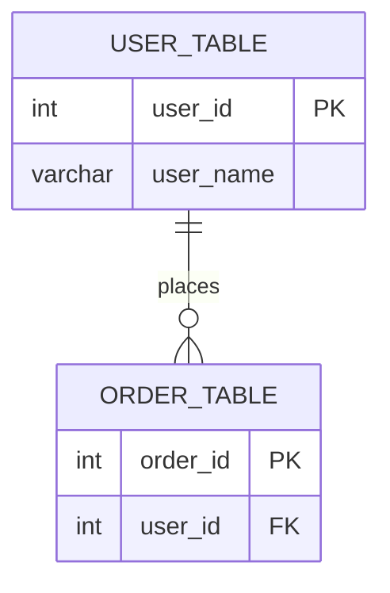

# Lesson 06 — Docker & PostgreSQL

Chạy PostgreSQL bằng Docker Compose (xem [docker-compose.yml](docker-compose.yml)).

**Nội dung khác:** [Quan hệ (relationship) trong SQL](SQL-RELATIONSHIPS.md)

## Các lệnh Docker thường dùng

| CMD | Ý nghĩa |
|---|---|
| `docker-compose up -d` | Lệnh để khởi động và tạo container (nếu chưa có) từ file cấu hình.<br>`-d` viết tắt của `--detach` → nghĩa là chạy ngầm (ẩn) |
| `docker-compose down` | Dừng và xóa toàn bộ container nhưng sẽ không xóa volume và image |
| `docker ps` | Xem những container đang chạy<br>(optional: `-a` để xem toàn bộ container) |
| `docker image` | Liệt kê toàn bộ image trên docker |
| `docker rmi <image id \| name>` | Xóa image cụ thể |
| `docker stop <container id \| name>` | Dừng 1 container cụ thể |
| `docker restart <container id \| name>` | Khởi động lại 1 container cụ thể |
| `docker rm <container id \| name>` | Xóa container (cần phải dừng trước khi xóa) |
| `docker volume ls` | Liệt kê toàn bộ volume trên host |
| `docker volume rm <volume name>` | Xóa volume (⚠️ nguy hiểm: sẽ mất toàn bộ dữ liệu nếu đang lưu trong volume) |

## Kết nối tới database

| Thông tin | Giá trị |
|---|---|
| Host | `localhost` |
| Port | `5432` |
| Database | `master-golang` |
| User | `root` |
| Password | xem `POSTGRES_PASSWORD` trong `docker-compose.yml` |

```bash
# Vào psql bên trong container
docker exec -it postgres-db psql -U root -d master-golang
```

## Import và Export database

**Export database** (dump toàn bộ database ra file `.sql` trên máy host):

```bash
docker exec -i postgres-db pg_dump -U root -d master-golang > ./backupdb-master-golang.sql
```

**Import database** (nạp lại file `.sql` vào database trong container):

```bash
docker exec -i postgres-db psql -U root -d master-golang < ./backupdb-master-golang.sql
```

> `-i` giữ stdin mở để `>` / `<` chuyển dữ liệu giữa host và container.
> Ở đây không dùng `-t` vì dữ liệu không đi qua terminal.

## Các câu truy vấn (SQL) hay sử dụng

Xem thêm ví dụ đầy đủ trong [hoc-sql.sql](hoc-sql.sql).

| Thao tác | Cú pháp |
|---|---|
| Thêm dữ liệu | `INSERT INTO table (col1, col2) VALUES (val1, val2)` |
| Cập nhật dữ liệu | `UPDATE table SET col1 = value1, col2 = val2 WHERE condition` |
| Xóa dữ liệu | `DELETE FROM table WHERE condition` |
| Lấy dữ liệu | `SELECT * FROM table WHERE condition ORDER BY col [DESC/ASC] LIMIT ... OFFSET ...` |

### ORDER BY — Sắp xếp kết quả

Sắp xếp các dòng trả về theo 1 hoặc nhiều cột. Mặc định là `ASC` (tăng dần), dùng `DESC` để giảm dần.

```sql
select * from products order by price desc;   -- giá cao -> thấp
select * from products order by price asc;    -- giá thấp -> cao

-- Sắp xếp theo nhiều cột: ưu tiên category_id trước, cùng category thì sắp theo price
select * from products order by category_id asc, price desc;
```

### LIMIT / OFFSET — Giới hạn & phân trang

`LIMIT` giới hạn số dòng trả về, `OFFSET` bỏ qua N dòng đầu tiên. Thường kết hợp với `ORDER BY` để phân trang (pagination) ổn định.

```sql
select * from products limit 3;              -- lấy 3 dòng đầu tiên
select * from products limit 3 offset 4;      -- bỏ qua 4 dòng, lấy 3 dòng tiếp theo

-- Phân trang: trang thứ `page` (bắt đầu từ 1), mỗi trang `page_size` dòng
-- offset = (page - 1) * page_size
select * from products order by product_id limit 10 offset 20; -- trang 3, 10 dòng/trang
```

### GROUP BY — Gom nhóm dữ liệu

Gom các dòng có cùng giá trị ở (các) cột chỉ định thành 1 nhóm, thường dùng chung với hàm tổng hợp (`count`, `sum`, `avg`, `min`, `max`).

```sql
-- Đếm số sản phẩm theo từng category
select category_id, count(*) as total from products
group by category_id;

-- Tổng giá trị sản phẩm theo từng category
select category_id, sum(price) as total_price from products
group by category_id;
```

> Mọi cột không nằm trong hàm tổng hợp ở mệnh đề `SELECT` đều phải xuất hiện trong `GROUP BY`.

### HAVING — Lọc sau khi gom nhóm

`WHERE` lọc từng dòng *trước khi* gom nhóm; `HAVING` lọc các nhóm *sau khi* đã `GROUP BY`, nên có thể dùng hàm tổng hợp trong điều kiện (`WHERE` thì không).

```sql
-- Chỉ lấy các category có nhiều hơn 2 sản phẩm
select category_id, count(*) from products
group by category_id
having count(*) > 2;

-- Kết hợp WHERE + GROUP BY + HAVING + ORDER BY
select category_id, count(*) as total from products
where status = 1
group by category_id
having count(*) >= 1
order by total desc;
```

### JOIN — Kết hợp dữ liệu từ nhiều bảng

Dùng để lấy dữ liệu liên quan giữa các bảng thông qua khóa ngoại (foreign key). Ví dụ dựa trên các bảng quan hệ trong [hoc-sql.sql](hoc-sql.sql) — xem thêm giải thích ở [SQL-RELATIONSHIPS.md](SQL-RELATIONSHIPS.md).

#### Hình dung trực quan (7 kiểu JOIN)

Quan hệ giữa 2 bảng mẫu dùng để minh hoạ bên dưới — 1 user có thể có nhiều order, nhưng cũng có thể chưa có order nào (`0..N`), và 1 order luôn thuộc về đúng 1 user (`1`):



> Mermaid không có kiểu Venn diagram (2 vòng tròn chồng nhau như hình bạn gửi), nên phần "vòng tròn giao nhau" mình minh hoạ bằng bảng kết quả bên dưới thay vì vẽ hình.

Giả sử có 2 bảng dữ liệu mẫu:

**USER_TABLE**

| user_id | user_name |
|---|---|
| 123 | Bob |
| 124 | Alice |
| 125 | Carrie |

**ORDER_TABLE**

| user_id | order_id |
|---|---|
| 123 | 333 |
| 123 | 222 |
| 126 | 111 |

→ Chú ý: `123` có ở cả 2 bảng, `124`/`125` chỉ có ở USER_TABLE, `126` chỉ có ở ORDER_TABLE. Đây chính là phần "giao nhau/lệch nhau" mà mỗi kiểu JOIN xử lý khác nhau:

| Kiểu JOIN | Lấy dòng nào | Kết quả với dữ liệu mẫu trên |
|---|---|---|
| `INNER JOIN` | Chỉ dòng khớp ở **cả 2** bảng | `123-Bob-333`, `123-Bob-222` |
| `LEFT JOIN` | Toàn bộ bảng **trái** (USER_TABLE), không khớp thì `order_id = NULL` | `123-Bob-333`, `123-Bob-222`, `124-Alice-NULL`, `125-Carrie-NULL` |
| `RIGHT JOIN` | Toàn bộ bảng **phải** (ORDER_TABLE), không khớp thì `user_name = NULL` | `123-Bob-333`, `123-Bob-222`, `126-NULL-111` |
| `FULL OUTER JOIN` | Toàn bộ dòng ở **cả 2** bảng, khớp được thì ghép, không thì `NULL` | `123-Bob-333`, `123-Bob-222`, `124-Alice-NULL`, `125-Carrie-NULL`, `126-NULL-111` |

```sql
select u.user_id, u.user_name, o.order_id
from user_table u
inner join order_table o on o.user_id = u.user_id;   -- chỉ user 123 (2 dòng)

select u.user_id, u.user_name, o.order_id
from user_table u
left join order_table o on o.user_id = u.user_id;    -- toàn bộ user (123, 124, 125)

select u.user_id, u.user_name, o.order_id
from user_table u
right join order_table o on o.user_id = u.user_id;   -- toàn bộ order (123, 123, 126)

select u.user_id, u.user_name, o.order_id
from user_table u
full outer join order_table o on o.user_id = u.user_id; -- toàn bộ cả 2 bên (123,124,125,126)
```

> Mẹo nhớ: `INNER` = giao nhau, `LEFT`/`RIGHT` = ưu tiên giữ trọn 1 bên + phần giao, `FULL OUTER` = hợp toàn bộ 2 bên. `RIGHT JOIN a ... b` luôn viết lại được thành `LEFT JOIN b ... a` (đổi vị trí 2 bảng) — vì vậy nhiều team quy ước chỉ dùng `LEFT JOIN` cho dễ đọc, tránh dùng `RIGHT JOIN`.

#### Áp dụng vào schema của bài học

```sql
-- INNER JOIN: chỉ lấy các dòng khớp ở cả 2 bảng (1-1: users - profiles)
select u.name, u.email, p.phone, p.address
from users u
inner join profiles p on p.user_id = u.user_id;

-- LEFT JOIN: lấy toàn bộ dòng bên trái (users), dòng nào không có profile thì cột profile = NULL
select u.name, p.phone
from users u
left join profiles p on p.user_id = u.user_id;

-- JOIN 1-nhiều: mỗi product kèm tên category tương ứng
select pr.name as product_name, c.name as category_name, pr.price
from products pr
inner join categories c on c.category_id = pr.category_id;

-- JOIN nhiều-nhiều qua bảng trung gian: student nào học course nào
select s.name as student_name, c.name as course_name
from students_courses sc
inner join students s on s.student_id = sc.student_id
inner join courses c on c.course_id = sc.course_id;
```

### Hàm tổng hợp (Aggregate functions)

Tính toán trên một tập dòng, thường dùng chung với `GROUP BY`.

| Hàm | Ý nghĩa |
|---|---|
| `COUNT(*)` | Đếm số dòng |
| `SUM(col)` | Tổng giá trị cột |
| `AVG(col)` | Giá trị trung bình |
| `MIN(col)` | Giá trị nhỏ nhất |
| `MAX(col)` | Giá trị lớn nhất |

```sql
select count(*) as total_products from products;
select avg(price) as avg_price from products;
select min(price) as min_price, max(price) as max_price from products;

-- Kết hợp với GROUP BY: giá trung bình theo từng category
select category_id, avg(price) as avg_price from products
group by category_id;
```

### DISTINCT — Loại bỏ giá trị trùng lặp

```sql
-- Danh sách category_id đang có sản phẩm (không trùng lặp)
select distinct category_id from products;

-- DISTINCT trên nhiều cột: các cặp (category_id, status) duy nhất
select distinct category_id, status from products;
```

### Subquery — Truy vấn lồng nhau

Một câu `SELECT` nằm bên trong câu truy vấn khác, dùng khi cần lọc dựa trên kết quả của 1 truy vấn khác.

```sql
-- Các sản phẩm thuộc category có tên 'Laptop'
select * from products
where category_id = (select category_id from categories where name = 'Laptop');

-- Users chưa có profile (subquery trong NOT IN)
select * from users
where user_id not in (select user_id from profiles);

-- Sản phẩm có giá cao hơn giá trung bình
select * from products
where price > (select avg(price) from products);
```

---

## Kiến thức nâng cao (Advanced)

Các chủ đề hay gặp trong công việc thực tế của backend developer, ví dụ đầy đủ nằm ở cuối [hoc-sql.sql](hoc-sql.sql).

### Transaction — Giao dịch

Gom nhiều câu lệnh thành 1 khối "tất cả hoặc không gì cả" (atomic). Nếu 1 bước lỗi giữa chừng, `ROLLBACK` sẽ huỷ toàn bộ, tránh dữ liệu bị nửa vời (ví dụ: trừ tiền tài khoản A nhưng chưa kịp cộng cho B).

```sql
begin;
update products set price = price - 500000 where product_id = 1;
update products set price = price + 500000 where product_id = 2;
commit;   -- lưu thật sự
-- rollback;  -- nếu có lỗi, huỷ toàn bộ transaction
```

- **SAVEPOINT**: đánh dấu 1 điểm giữa transaction để rollback về đó thay vì huỷ toàn bộ.
- **Isolation level**: `READ COMMITTED` (mặc định ở Postgres) → `REPEATABLE READ` → `SERIALIZABLE`, mức càng cao càng an toàn với dữ liệu đọc song song nhưng càng dễ bị block/conflict.

### UPSERT — INSERT hoặc UPDATE nếu đã tồn tại

`INSERT ... ON CONFLICT` cần dựa trên 1 cột `UNIQUE`/`PRIMARY KEY` để biết dòng nào là "trùng".

```sql
insert into users (name, email)
values ('Vu Quoc Tuan', 'contact.quoctuan@gmail.com')
on conflict (email) do update
set name = excluded.name;   -- excluded = giá trị định insert vào

insert into categories (name) values ('Laptop')
on conflict (name) do nothing;   -- trùng thì bỏ qua
```

### Window functions — Hàm cửa sổ

Khác `GROUP BY`: window function **không gom dòng lại**, mỗi dòng gốc vẫn giữ nguyên, chỉ thêm 1 cột tính toán dựa trên "cửa sổ" (partition) xung quanh nó.

```sql
-- Đánh số / xếp hạng sản phẩm theo giá, riêng trong từng category
select
	product_id, category_id, name, price,
	row_number() over (partition by category_id order by price desc) as row_num,
	rank() over (partition by category_id order by price desc) as price_rank
from products;

-- Tổng giá trị category ngay trên từng dòng sản phẩm
select product_id, name, category_id, price,
	sum(price) over (partition by category_id) as total_category_price
from products;
```

### CTE (WITH) — Truy vấn lồng nhau dễ đọc hơn subquery

```sql
with expensive_products as (
	select * from products where price > 1000000
)
select category_id, count(*) from expensive_products
group by category_id;
```

**Recursive CTE** dùng cho dữ liệu phân cấp (cây thư mục, sơ đồ tổ chức, danh mục cha-con...):

```sql
-- employees tự tham chiếu chính nó qua manager_id
with recursive subordinates as (
	select employee_id, name, manager_id from employees where name = 'CEO Nam'
	union all
	select e.employee_id, e.name, e.manager_id
	from employees e
	inner join subordinates s on e.manager_id = s.employee_id
)
select * from subordinates;
```

### Index & EXPLAIN ANALYZE — Tối ưu truy vấn

Index tăng tốc tìm kiếm/lọc/sắp xếp trên 1 cột, đánh đổi bằng việc `INSERT`/`UPDATE` chậm hơn (vì phải cập nhật cả index).

```sql
create index if not exists idx_products_category_id on products (category_id);

-- Xem Postgres THẬT SỰ chạy truy vấn thế nào: có dùng index không, mất bao lâu
explain analyze
select * from products where category_id = 1;
```

> Chỉ nên đánh index trên các cột hay dùng trong `WHERE`, `JOIN`, `ORDER BY` — đánh index tràn lan làm chậm ghi dữ liệu mà không tăng thêm lợi ích.

### Locking — Khoá dòng khi cập nhật đồng thời

`SELECT ... FOR UPDATE` khoá các dòng vừa đọc; transaction khác muốn sửa dòng đó phải đợi tới khi transaction hiện tại `COMMIT`/`ROLLBACK`. Dùng khi đọc số dư/tồn kho rồi ghi lại, để tránh race condition (2 request cùng đọc giá trị cũ rồi ghi đè nhau).

```sql
begin;
select * from products where product_id = 1 for update;
update products set price = price - 100000 where product_id = 1;
commit;
```

### JSON / JSONB — Dữ liệu dạng JSON (đặc trưng của Postgres)

```sql
alter table products add column metadata jsonb;

update products set metadata = '{"color": "black", "warranty_months": 12, "tags": ["hot", "new"]}'
where product_id = 1;

select metadata -> 'color' as color_json, metadata ->> 'color' as color_text from products; -- -> JSON, ->> text
select * from products where metadata ->> 'color' = 'black';
select * from products where metadata @> '{"warranty_months": 12}'; -- @> kiểm tra "chứa"
```

### EXISTS vs IN

```sql
-- IN: so khớp với 1 danh sách giá trị
select * from products
where category_id in (select category_id from categories where name in ('Laptop', 'Dien thoai'));

-- EXISTS: chỉ kiểm tra CÓ tồn tại dòng khớp hay không — thường nhanh hơn IN với bảng lớn
select * from categories c
where exists (select 1 from products p where p.category_id = c.category_id);
```

### UNION / INTERSECT / EXCEPT

| Toán tử | Ý nghĩa |
|---|---|
| `UNION` | Gộp kết quả 2 truy vấn, tự loại bỏ trùng lặp |
| `UNION ALL` | Gộp kết quả, giữ nguyên trùng lặp (nhanh hơn `UNION`) |
| `INTERSECT` | Chỉ lấy dòng xuất hiện ở cả 2 truy vấn |
| `EXCEPT` | Lấy dòng có ở truy vấn 1 nhưng không có ở truy vấn 2 |

```sql
select name from users
union all
select name from students;
```

### CASE WHEN — Rẽ nhánh điều kiện trong SELECT

```sql
select name, price,
	case
		when price < 1000000 then 'Rẻ'
		when price between 1000000 and 10000000 then 'Trung bình'
		else 'Đắt'
	end as price_range
from products;
```

### Hàm xử lý ngày giờ & chuỗi thường dùng

```sql
select now();                              -- thời điểm hiện tại
select now() - interval '7 days';          -- 7 ngày trước
select age(now(), '2020-01-01'::date);     -- khoảng cách thời gian

select upper(name), lower(email) from users;
select concat(name, ' <', email, '>') as display_name from users;
select substring(email from 1 for 3) from users;
select trim('  hello  ');
```
