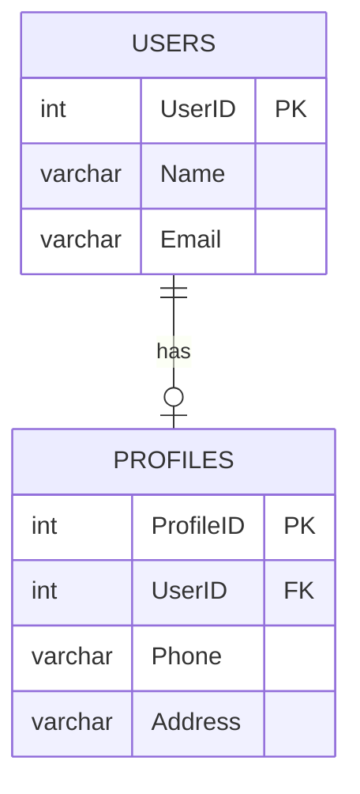
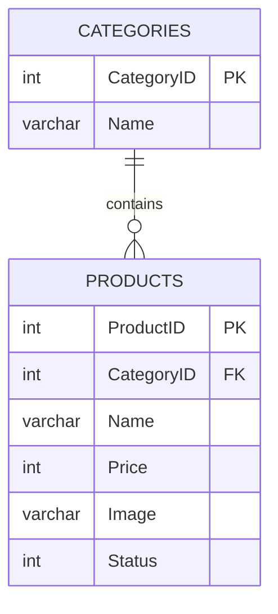
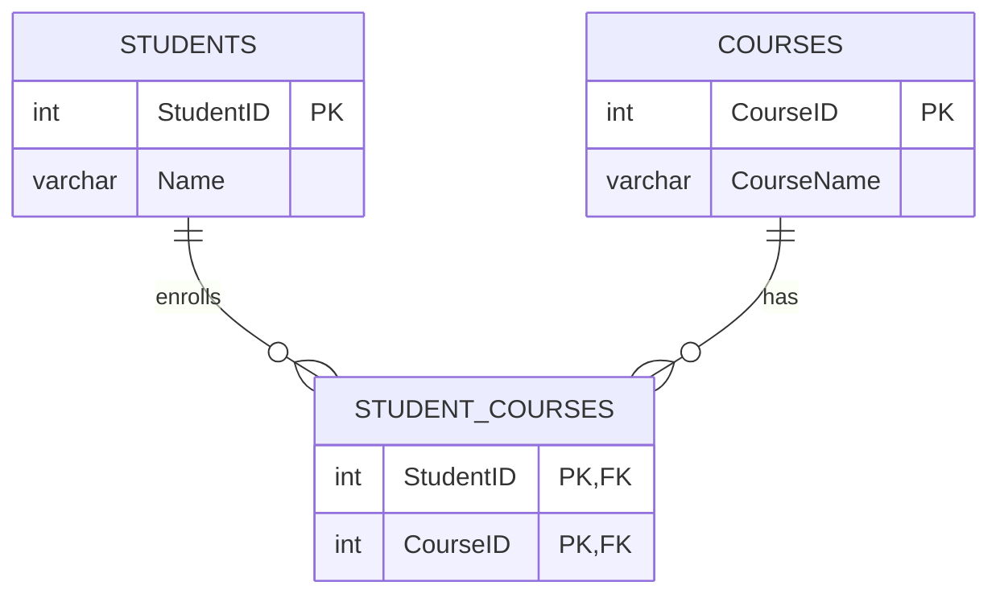

# Quan hệ (relationship) trong SQL

> Phần Docker / PostgreSQL: xem [README.md](README.md).

Có 3 loại quan hệ cơ bản. Ý tưởng chung: **khóa ngoại (foreign key) luôn nằm ở bảng
"nhiều"**, và nó trỏ về khóa chính (primary key) của bảng "một".

| Loại | Khóa ngoại đặt ở đâu | Ví dụ |
|---|---|---|
| One – One | Bảng phụ, có ràng buộc `UNIQUE` | `Users` ↔ `Profiles` |
| One – Many | Bảng "nhiều" | `Categories` → `Products` |
| Many – Many | Bảng trung gian (junction table) | `Students` ↔ `Student_Courses` ↔ `Courses` |

## 5.1 One – One

Một user chỉ có **tối đa 1** profile, và một profile chỉ thuộc về **1** user.



```sql
CREATE TABLE users (
    user_id SERIAL PRIMARY KEY,
    name    VARCHAR(100) NOT NULL,
    email   VARCHAR(150) NOT NULL UNIQUE
);

CREATE TABLE profiles (
    profile_id SERIAL PRIMARY KEY,
    -- UNIQUE là điểm mấu chốt: nó biến one-many thành one-one
    user_id    INT NOT NULL UNIQUE REFERENCES users(user_id) ON DELETE CASCADE,
    phone      VARCHAR(20),
    address    VARCHAR(255)
);
```

Dữ liệu mẫu:

| UserID | Name | Email |
|---|---|---|
| 1 | Quốc Tuấn | contact.quoctuan@gmail.com |
| 2 | Tony Tèo | tony@gmail.com |

| ProfileID | UserID | Phone | Address |
|---|---|---|---|
| 1 | 1 | 0901234567 | 123 Nguyễn Thông |
| 2 | 2 | 0907364721 | 456 Cách Mạng Tháng Tám |

```sql
SELECT u.name, u.email, p.phone, p.address
FROM users u
LEFT JOIN profiles p ON p.user_id = u.user_id;
```

## 5.2 One – Many

Một category có **nhiều** product, nhưng một product chỉ thuộc về **1** category.
Đây là loại quan hệ hay gặp nhất.



```sql
CREATE TABLE categories (
    category_id SERIAL PRIMARY KEY,
    name        VARCHAR(100) NOT NULL
);

CREATE TABLE products (
    product_id  SERIAL PRIMARY KEY,
    -- không có UNIQUE → 1 category được phép có nhiều product
    category_id INT NOT NULL REFERENCES categories(category_id),
    name        VARCHAR(150) NOT NULL,
    price       INT NOT NULL,
    image       VARCHAR(255),
    status      INT NOT NULL DEFAULT 1
);
```

Dữ liệu mẫu:

| CategoryID | Name |
|---|---|
| 1 | Điện thoại |
| 2 | Laptop |

| ProductID | CategoryID | Name | Price | Image | Status |
|---|---|---|---|---|---|
| 1 | 2 | Macbook Pro 2026 | 35.000.000 | macbook-dep.jpg | 1 |
| 2 | 1 | iPhone 18 | 20.000.000 | iphone-new.jpg | 2 |
| 3 | 2 | Laptop Asus | 30.500.000 | laptop-asus.png | 2 |

```sql
-- Lấy sản phẩm kèm tên danh mục
SELECT p.name AS product, c.name AS category, p.price
FROM products p
JOIN categories c ON c.category_id = p.category_id;

-- Đếm số sản phẩm mỗi danh mục
SELECT c.name, COUNT(p.product_id) AS total
FROM categories c
LEFT JOIN products p ON p.category_id = c.category_id
GROUP BY c.name;
```

## 5.3 Many – Many

Một student học **nhiều** course, một course có **nhiều** student.
SQL không lưu trực tiếp được quan hệ này, nên cần một **bảng trung gian**
(`student_courses`) chứa 2 khóa ngoại và dùng chúng làm khóa chính kép (composite key).



```sql
CREATE TABLE students (
    student_id SERIAL PRIMARY KEY,
    name       VARCHAR(100) NOT NULL
);

CREATE TABLE courses (
    course_id   SERIAL PRIMARY KEY,
    course_name VARCHAR(150) NOT NULL
);

CREATE TABLE student_courses (
    student_id INT NOT NULL REFERENCES students(student_id) ON DELETE CASCADE,
    course_id  INT NOT NULL REFERENCES courses(course_id)  ON DELETE CASCADE,
    -- khóa chính kép: 1 student không thể đăng ký trùng 1 course 2 lần
    PRIMARY KEY (student_id, course_id)
);
```

Dữ liệu mẫu:

| StudentID | Name |
|---|---|
| 1 | Vũ Quốc Tuấn |
| 2 | Trần Văn Tèo |

| CourseID | CourseName |
|---|---|
| 1 | Lập Trình Golang |
| 2 | Lập Trình Gin |

| StudentID | CourseID |
|---|---|
| 1 | 1 |
| 2 | 1 |
| 1 | 2 |

```sql
-- Mỗi student đang học những course nào
SELECT s.name, c.course_name
FROM students s
JOIN student_courses sc ON sc.student_id = s.student_id
JOIN courses c          ON c.course_id  = sc.course_id
ORDER BY s.name;
```

## Ghi nhớ nhanh

- Ký hiệu trên sơ đồ: `0..1` = không hoặc một, `1` = đúng một, `*` = nhiều.
- `ON DELETE CASCADE`: xóa bản ghi cha thì bản ghi con cũng bị xóa theo.
- Nên tạo index cho cột khóa ngoại (`category_id`, `user_id`, …) để `JOIN` chạy nhanh hơn.
- One-one và one-many chỉ khác nhau ở ràng buộc `UNIQUE` trên cột khóa ngoại.
